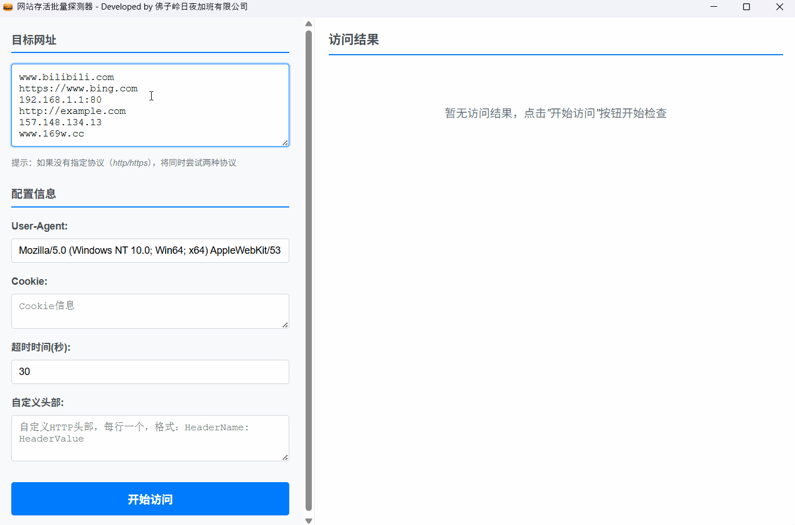

# WebChecker-RS

一个基于 Tauri + Vue 3 的现代化桌面应用，用于批量检查网站状态和响应信息。

> 🔗 本项目受 [github.com/ScriptKid-Beta/WebBatchRequest](https://github.com/ScriptKid-Beta/WebBatchRequest) 启发，采用现代技术栈重构实现部分功能。



## ✨ 特性

- 🖥️ **跨平台桌面应用** - 基于 Tauri 构建，支持 Windows、macOS 和 Linux
- 🌐 **批量网站检查** - 支持同时检查多个网站的 HTTP 状态
- 📊 **智能结果展示** - 表格形式展示详细的响应信息
- 🔄 **实时进度跟踪** - 实时显示检查进度和结果统计
- 📁 **数据导出** - 支持将结果导出为 XLSX 格式
- ⚡ **高性能** - Rust 后端提供优异的性能表现
- 🎨 **现代化界面** - Vue 3 + 响应式设计

## 🛠️ 技术栈

### 前端技术

- **Vue 3** - 现代化前端框架
- **Vite** - 快速构建工具
- **Composition API** - Vue 3 组合式 API
- **响应式设计** - 适配不同屏幕尺寸

### 后端技术

- **Rust** - 系统级编程语言，提供高性能后端
- **Tauri** - 跨平台桌面应用框架
- **Reqwest** - Rust HTTP 客户端库
- **Tokio** - Rust 异步运行时

### 核心功能库

- **XLSX** - Excel 文件导出功能

## 📦 安装与运行

### 环境要求

- Node.js 18+
- Rust 1.70+
- Tauri CLI

### 开发环境搭建

1. **安装 Rust**

```bash
curl --proto '=https' --tlsv1.2 -sSf https://sh.rustup.rs | sh
```

2. **安装 Tauri CLI**

```bash
cargo install tauri-cli
```

3. **安装项目依赖**

```bash
npm install
```

4. **开发模式运行**

```bash
npm run tauri dev
```

5. **构建应用**

```bash
npm run tauri build
```

## 🚀 使用指南

### 基本操作

1. **输入目标网址**

   - 在左侧输入框中输入要检查的网址
   - 支持批量输入，每行一个网址
   - 未指定协议时自动尝试 HTTP/HTTPS

2. **配置请求参数**

   - 自定义 User-Agent
   - 设置 Cookie 和超时时间
   - 添加自定义请求头

3. **开始检查**

   - 点击『开始访问』按钮
   - 实时查看检查进度和结果

4. **查看结果**
   - 表格形式展示详细响应信息
   - 支持按单个字段排序
   - 统计成功/失败数量
   - 支持将结果导出为 XLSX 文件

## 🔧 核心组件说明

### useWebChecker

核心业务逻辑组合式函数，管理：

- 目标网址列表
- 请求配置参数
- 检查进度状态
- 结果数据管理

### 组件架构

采用模块化组件设计，每个组件职责单一：

- **UrlInput**: 网址输入和管理
- **ConfigForm**: 请求参数配置
- **ControlButtons**: 开始/停止控制
- **ResultsTable**: 结果展示和导出

## 🌟 技术亮点

### 1. 现代化前端架构

- 使用 Vue 3 Composition API 实现响应式数据流
- 组件化开发，代码可维护性强
- 基于 Vite 的快速开发体验

### 2. Rust 高性能后端

- Rust 语言提供内存安全和并发安全
- 异步 HTTP 请求处理，支持高并发检查
- 系统级性能优化

### 3. 跨平台桌面应用

- Tauri 框架实现真正的原生应用体验
- 极小的应用体积和内存占用
- 原生系统集成能力

## 🤝 贡献指南

欢迎提交 Issue 和 Pull Request！项目采用标准的 Git 工作流：

1. Fork 本项目
2. 创建功能分支 (`git checkout -b feature/AmazingFeature`)
3. 提交更改 (`git commit -m 'Add some AmazingFeature'`)
4. 推送到分支 (`git push origin feature/AmazingFeature`)
5. 开启 Pull Request

## 📄 许可证

本项目采用 MIT 许可证 - 查看 [LICENSE](LICENSE) 文件了解详情。

## 🙏 致谢

感谢 [ScriptKid-Beta/WebBatchRequest](https://github.com/ScriptKid-Beta/WebBatchRequest) 项目的灵感启发。

---

**Made with ❤️ using Tauri + Vue 3 + Rust**
